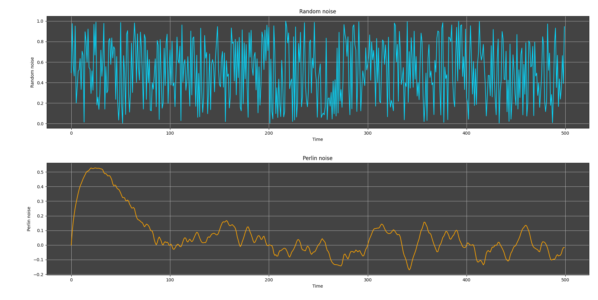
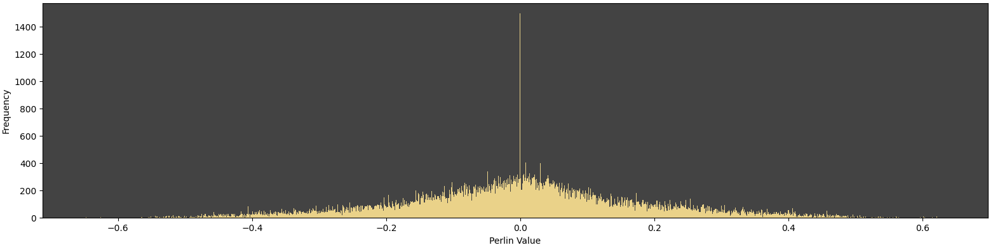
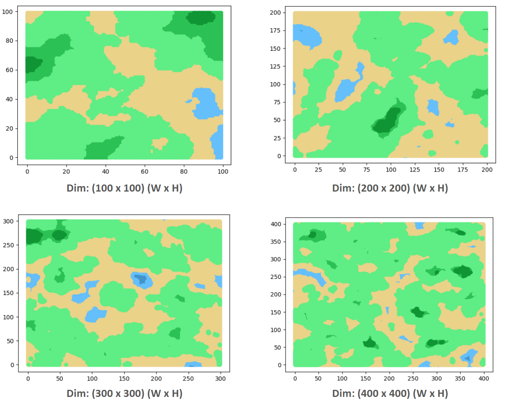

# Procedural Terrain Generator (PTG) - Blender Addon
## Content
- Blender Addon Installation Guide
  - Install Python
  - Install Microsoft c++ 14.0 or higher
  - Install the python library dependencies
  - Install the addon in blender 
- Blender Quick Tutorial and Demo
- Why noise lib over Builtin Blender Noise
- Perlin Noise Preimer
- Addon - code - documentation
## PTG Blender-Addon Installation Guide
>📌
>The **"Procedural Terrain Generator"** addon uses the `noise` Python library for Perlin noise. Since `noise` is a C extension, it requires Python development headers, which are not included in Blender's embedded Python.
>
>To work around this and keep Blender responsive, we use Inter-Process Communication (IPC). This means:
>- Blender's Python handles the UI and Blender API.
>- A separate, globally installed Python (with the noise library) performs the heavy noise calculations. This offloads computation and prevents Blender from freezing.
>
> **To use this addon, you need:**
> - Python 3.x (globally installed on your system)
> - Microsoft Visual C++ 14.0 or higher (for Windows, a C++ compiler for noise library compilation)

### Install Python
<details>
  <summary>How to install Python (click to expand)</summary>

  >**Python 3.x (globally installed on your system)**
  >
  > Having a global Python installation is crucial for your Blender addon's IPC system.
  >
  > Steps to install:
  >
  > **For Windows:**
  > - **Download the Installer:**
  >     - Go to the official Python website: https://python.org/downloads/windows/
  >     - Look for the latest stable **Python 3.x.x** version (e.g., Python 3.10.x, 3.11.x, or 3.12.x).
  >     - Download the "**Windows installer (64-bit)**" executable.
  > - **Run the Installer:**
  >     - Locate the downloaded `.exe` file and double-click it to run.
  >     - **Crucial Step:** On the first screen of the installer, check the box that says "**Add Python X.Y to PATH**" (where X.Y is your Python version). This is very important for your addon to find Python.
  >     - Select "**Install Now**" (recommended for most users).
  >     - If prompted by User Account Control (UAC), click "Yes".
  > - **Complete Installation**
  >     - The installation will proceed. Once finished, you might see a "Setup was successful" message.
  >     - Click "Close".
  > - **Verify Installation:**
  >     - Open a **new** Command Prompt window (search for `cmd` in Start Menu).
  >     - Type `python --version` and press Enter.
  >     - You should see the installed Python version (e.g., `Python 3.10.10`).
  >     - If it says "Python is not recognized...", close the Command Prompt and open a new one. If it still doesn't work, you might need to manually add Python to your PATH or reinstall, ensuring the "Add to PATH" box was checked.
 >
 > **For macOS:**
 > - **Check for Pre-installed Python (and Homebrew):**
 >      - macOS often comes with an older Python 2.x. For Python 3.x, it's highly recommended to use a package manager like Homebrew.
 >      - Open **Terminal** (Applications > Utilities > Terminal).
 >      - Check if Homebrew is installed: `brew --version`
 >      - If not installed, install Homebrew:
 >      ````
 >       /bin/bash -c "$(curl -fsSL https://raw.githubusercontent.com/Homebrew/install/HEAD/install.sh)"
 >       
 >>  Follow the on-screen instructions, which might include running `brew doctor` and adding Homebrew to your PATH.
 > - **Install Python 3 using Homebrew:**
 >      - Once Homebrew is installed, run:
 > 
 >       brew install python
 >      - Homebrew will install the latest Python 3.x and link it correctly.
 > - **Verify Installation:**
 >      - In the same Terminal window (or open a new one), type `python3 --version` and press Enter.
 >      - You should see the installed Python 3.x version (e.g., `Python 3.10.10`).
 >      - `python --version` might still point to an older Python 2.x, but `python3` will point to the Homebrew installed version. Your addon's `util.py` is designed to find `python` or `python3`.
 >
 >**For Linux (Ubuntu/Debian-based):**
 > - **Check for Python 3:**
 >      - Most modern Linux distributions come with Python 3 pre-installed.
 >      - Open **Terminal**.
 >      - Type `python3 --version` and press Enter. You'll likely see a version like `Python 3.8.10` or newer.
 > - **Install if Missing or for Specific Version:**
 >      - If Python 3 is not installed or you need a specific version, use your distribution's package manager.
 >      - For Ubuntu/Debian-based systems:
 >        ````
>         sudo apt update
>         sudo apt install python3
>         sudo apt install python3-pip # Install pip for Python 3
>         sudo apt install python3-dev # Essential for compiling C extensions like 'noise'
 >         ````
 >          - `python3-dev` (or similar package name like `python3-devel` on Fedora/RHEL) provides the necessary Python development headers.
 > - **Verify Installation:**
 >       -  Type `python3 --version` and `pip3 --version` to confirm.


</details>

### Install Microsoft Visual C++ 14.0 or greater

<details>
  <summary>How to install Microsoft Visual C++ (click to expand)</summary>

  >**Microsoft Visual C++ 14.0 or greater is required**
  >
  >Steps to install:
  >
  >- Download Visual Studio Build Tools:
  >    - Go to the official Visual Studio downloads page: https://visualstudio.microsoft.com/downloads/
  >    - Scroll down to the "Tools for Visual Studio" section.
  >    - Look for "Build Tools for Visual Studio 2022" (or the latest available version, e.g., 2019). Click the `Download` button next to it.
  >- Run the Installer:
  >    - Once the `vs_buildtools__*.exe` file is downloaded, run it.
  >    - The Visual Studio Installer will open.
  >- Select Workloads:
  >    - In the installer, go to the `Workloads` tab.
  >    - Crucially, select `Desktop development with C++`. This workload includes the C++ compilers and libraries that Python needs.
  >- Install:
  >    - Click the `Install` button. The installation might take some time as it downloads and sets up the components.
  >- Restart (Optional but Recommended):
  >    - After the installation completes, it's a good idea to restart your computer, although it's not always strictly necessary. This ensures all environment variables are correctly set.
</details>

> 📌 **Alternate to Microsoft Visual C++**
> 
> **MinGW-w64** is a much lighter-weight alternative to installing the full Visual Studio Build Tools. It provides a GCC (GNU Compiler Collection) environment that can compile C/C++ code for Windows.
>
> **Pros of MinGW-w64:**
> - **Smaller Size:** Significantly smaller download and installation footprint compared to Visual Studio.
> - **Open Source:** Fully open-source compiler toolchain.
> - **Cross-Platform Familiarity:** If you're used to GCC on Linux, MinGW-w64 provides a similar environment on Windows.
>
> **Cons of MinGW-w64 (in this context)**:
> - **Setup Can Be Tricky:** While smaller, getting MinGW-w64 set up correctly and ensuring pip finds it can sometimes be less straightforward than with MSVC, which Python's official installers are often pre-configured to work with.
> - **Potential Compatibility:** Very rarely, some C extensions might have specific build flags or code that is more optimized or compatible with MSVC, but for common libraries like noise, GCC usually works fine.

###  Install the python library dependencies
After installing the Python and Microsoft Visual C++, download the PTG Blender Addon [from here]() 

open your terminal/command prompt and run the following command:
```Bash
pip install numpy noise
```

Once all the necessary libraries and language packesges are installed
### Install the Addon in Blender
- **Open Blender:** Launch your Blender application.
- **Go to Preferences:**
    - In Blender, go to `Edit` (top menu bar) > `Preferences...`.
- **Navigate to Add-ons:**
    - In the Blender Preferences window, click on the `Add-ons` tab on the left sidebar.
- **Click "Install...":**
    - At the top right of the Add-ons tab, you'll see a button labeled `Install...`. Click it.
- **Browse to your Addon Folder:**
    - A file browser window will appear. Navigate to the location where you have downloaded the `Procedural_Terrain_Generator.zip` file.
    - **Important**: Do NOT unzip the `Procedural_Terrain_Generator.zip` file
    - Select the `Procedural_Terrain_Generator.zip` file
    - Click the Install Add-on button in the file browser.
- **Search for the Addon:**
    - After clicking "Install Add-on", you'll be returned to the `Add-ons` tab in Preferences.
    - In the search bar (top left of the Add-ons tab), type `Procedural Terrain Generator`
- **Activate the Checkbox:**
    - The addon, "Procedural Terrain Generator," should appear in the list.
    - Check the checkbox next to its name to enable it.
- **Save the preferences:**
    - To ensure the addon remains enabled every time you open Blender, click the `☰` (three-line) icon at the bottom-left of the Preferences window and select `Save Preferences`.
- **Close Preferences:** Close the Blender Preferences window.
- **Open the N-Panel:** In the 3D Viewport, press the `N` key on your keyboard. This will open the sidebar (also known as the N-panel or Properties panel) on the right side of the viewport.
- **Find the "PTG Tools" Tab:**
    - Look for a new tab in the N-panel labeled **"PTG Tools"**.
    - Click on this tab.
- **Use the Addon:**
    - You should now see the "Terrain Generator Properties" panel with all your sliders and buttons.
    - Click the **"Generate Terrain"** button to create your first terrain!

 

**The Installer package structure:**
```
├── PTG_Installer_Package
├──── Procedural_Terrain_Generator.zip
├──── PTG Installation Guide.pdf
├──── README.txt
```

## Why PTG Blender Addon:
It's an insightful question that why would someone choose **PTG Blender Addon**, while Blender does has its own buit-in noise capabilities, primarily exposed through:
1. **mathutils.noise** module: A Python module that provides various noise Function (Perlin, Simplex, Voronoi, etc) directly accessaible via Python.
2. **Shader Nodes**: These are visual nodes used in Blender's material and geometry node editors, which are highly optimized C/C++ implementations of various noise algorithms. While not directly callable from Python in the same way, they represent Blender's native noise generation.

### PTG Blender Addon - Pros 
PTG blender addon's approach offers distinct advantages, particularly for the specific problem of generating large-scale, complex terrain:
- **Access to Specialized, Optimized Libraries:**
    - The `noise` library (which the PTG addon uses) is a dedicated, highly optimized C-extension for Perlin and Simplex noise. It's often faster and more robust for these specific noise types than Blender's more general-purpose `mathutils.noise`.
    - This allows to leverage cutting-edge or specialized noise algorithms that might not be exposed or implemented in Blender's core API.
- **True Offloading (IPC):**
    - This is the biggest advantage. By running the heavy noise computation in a separate Python process, PTG addon prevents Blender's main thread from freezing.
    - When a user drag a slider, Blender's UI remains responsive, even if the external script takes a moment to calculate. This is a massive improvement in **user experience** for computationally intensive tasks.
    - If one uses `mathutils.noise` directly in Blender's main Python thread for a 1000x1000 terrain, Blender would likely become unresponsive ("Not Responding") while it computes.
- **Flexibility and Maintainability:** (Developers perspective)
    - Separating the core noise logic into an external script makes it more modular. Any developer could potentially swap out the noise library for another (e.g., opensimplex, perlin_noise) without needing to re-architect the Blender addon's core.
    - It decouples the noise generation from Blender's specific Python environment, making it easier to manage dependencies that Blender doesn't natively support.
- **Reproducibility (Precise Noise Algorithm):**
    - If a very specific implementation of Perlin or Simplex noise (e.g., for compatibility with other software or specific visual styles) is needed, using a well-defined external library like `noise` ensures that exact algorithm is used, whereas Blender's internal `PERLIN_ORIGINAL` or `PERLIN_NEW` might have subtle differences.

## Random Noise vs Perlin Noise



## Perlin Noise - Normal (Bell Curve) Behaviour


## Perlin Noise (2 Dimensional) (simple 2d map geneartion)


> Image generation through matplotlib is costly (heavy time consuming). Hence PIL library in python for image manipulation is used.


## Terrain Generation (Composite perlin noise approach)

