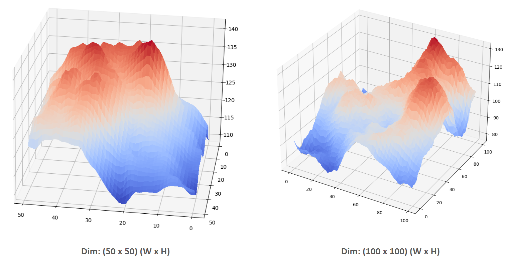

# Procedural Terrain Generator (PTG)
## PTG Addon - Table of Contents

- 1 PTG Blender-Addon Installation Guide
	- 1.1 Installation Overview
	- 1.2 Install Python: Step 1
	- 1.3 Install Microsoft Visual C++: Step 2
	- 1.4 Install Python library dependencies: Step 3
	- 1.5 Install PTG Addon (in Blender): Step 4
- 2 Why PTG Blender Addon
	- 2.1 PTG Blender Addon - Pros 
- 3 Perlin Noise: Primer
	- 3.1 Random Noise vs Perlin Noise
		- 3.1.1 Uniform Random Noise
		- 3.1.2 Perlin Noise
	- 3.2 Perlin Noise as Terrain Generator
	- 3.3 Perlin Noise and its "Bell Curve" Tendency
		- 3.3.1 How the - Bell Curve Tendency - is useful in Terrain Generation
- 4 Perlin Noise Presentation
	- 4.1 Colour Schematic 2D representation
	- 4.2 Terrain Generation 3D (Matplotlib)

## PTG Documentation - Table of Contents
# Procedural Terrain Generator (PTG) - Blender Addon
## 1. PTG Blender-Addon Installation Guide
>📌 Note:
>The **"Procedural Terrain Generator"** addon uses the `noise` Python library for Perlin noise. Since `noise` is a C extension, it requires Python development headers, which are not included in Blender's embedded Python.
>
>To work around this and keep Blender responsive, we use Inter-Process Communication (IPC). This means:
>- Blender's Python handles the UI and Blender API.
>- A separate, globally installed Python (with the noise library) performs the heavy noise calculations. This offloads computation and prevents Blender from freezing.
>
> **To use this addon, you need:**
> - Python 3.x (globally installed on your system)
> - Microsoft Visual C++ 14.0 or higher (for Windows, a C++ compiler for noise library compilation)

### 1.1 Installation Overview
- Step 1: Install Python in your device
- Step 2: Install Microsoft Visual C++ 14.0 or greater in your device
- Step 3: Install the library dependencies
- Step 4: Install the Blender Addon

### 1.2 Install Python: Step 1
<details>
  <summary>How to install Python (click to expand)</summary>

  >**Python 3.x (globally installed on your system)**
  >
  > Having a global Python installation is crucial for your Blender addon's IPC system.
  >
  > Steps to install:
  >
  > **For Windows:**
  > - **Download the Installer:**
  >     - Go to the official Python website: https://python.org/downloads/windows/
  >     - Look for the latest stable **Python 3.x.x** version (e.g., Python 3.10.x, 3.11.x, or 3.12.x).
  >     - Download the "**Windows installer (64-bit)**" executable.
  > - **Run the Installer:**
  >     - Locate the downloaded `.exe` file and double-click it to run.
  >     - **Crucial Step:** On the first screen of the installer, check the box that says "**Add Python X.Y to PATH**" (where X.Y is your Python version). This is very important for your addon to find Python.
  >     - Select "**Install Now**" (recommended for most users).
  >     - If prompted by User Account Control (UAC), click "Yes".
  > - **Complete Installation**
  >     - The installation will proceed. Once finished, you might see a "Setup was successful" message.
  >     - Click "Close".
  > - **Verify Installation:**
  >     - Open a **new** Command Prompt window (search for `cmd` in Start Menu).
  >     - Type `python --version` and press Enter.
  >     - You should see the installed Python version (e.g., `Python 3.10.10`).
  >     - If it says "Python is not recognized...", close the Command Prompt and open a new one. If it still doesn't work, you might need to manually add Python to your PATH or reinstall, ensuring the "Add to PATH" box was checked.
 >
 > **For macOS:**
 > - **Check for Pre-installed Python (and Homebrew):**
 >      - macOS often comes with an older Python 2.x. For Python 3.x, it's highly recommended to use a package manager like Homebrew.
 >      - Open **Terminal** (Applications > Utilities > Terminal).
 >      - Check if Homebrew is installed: `brew --version`
 >      - If not installed, install Homebrew:
 >      ````
 >       /bin/bash -c "$(curl -fsSL https://raw.githubusercontent.com/Homebrew/install/HEAD/install.sh)"
 >       
 >>  Follow the on-screen instructions, which might include running `brew doctor` and adding Homebrew to your PATH.
 > - **Install Python 3 using Homebrew:**
 >      - Once Homebrew is installed, run:
 > 
 >       brew install python
 >      - Homebrew will install the latest Python 3.x and link it correctly.
 > - **Verify Installation:**
 >      - In the same Terminal window (or open a new one), type `python3 --version` and press Enter.
 >      - You should see the installed Python 3.x version (e.g., `Python 3.10.10`).
 >      - `python --version` might still point to an older Python 2.x, but `python3` will point to the Homebrew installed version. Your addon's `util.py` is designed to find `python` or `python3`.
 >
 >**For Linux (Ubuntu/Debian-based):**
 > - **Check for Python 3:**
 >      - Most modern Linux distributions come with Python 3 pre-installed.
 >      - Open **Terminal**.
 >      - Type `python3 --version` and press Enter. You'll likely see a version like `Python 3.8.10` or newer.
 > - **Install if Missing or for Specific Version:**
 >      - If Python 3 is not installed or you need a specific version, use your distribution's package manager.
 >      - For Ubuntu/Debian-based systems:
 >        ````
>         sudo apt update
>         sudo apt install python3
>         sudo apt install python3-pip # Install pip for Python 3
>         sudo apt install python3-dev # Essential for compiling C extensions like 'noise'
 >         ````
 >          - `python3-dev` (or similar package name like `python3-devel` on Fedora/RHEL) provides the necessary Python development headers.
 > - **Verify Installation:**
 >       -  Type `python3 --version` and `pip3 --version` to confirm.


</details>

### 1.3 Install Microsoft Visual C++: Step 2

<details>
  <summary>How to install Microsoft Visual C++ (click to expand)</summary>

  >**Microsoft Visual C++ 14.0 or greater is required**
  >
  >Steps to install:
  >
  >- Download Visual Studio Build Tools:
  >    - Go to the official Visual Studio downloads page: https://visualstudio.microsoft.com/downloads/
  >    - Scroll down to the "Tools for Visual Studio" section.
  >    - Look for "Build Tools for Visual Studio 2022" (or the latest available version, e.g., 2019). Click the `Download` button next to it.
  >- Run the Installer:
  >    - Once the `vs_buildtools__*.exe` file is downloaded, run it.
  >    - The Visual Studio Installer will open.
  >- Select Workloads:
  >    - In the installer, go to the `Workloads` tab.
  >    - Crucially, select `Desktop development with C++`. This workload includes the C++ compilers and libraries that Python needs.
  >- Install:
  >    - Click the `Install` button. The installation might take some time as it downloads and sets up the components.
  >- Restart (Optional but Recommended):
  >    - After the installation completes, it's a good idea to restart your computer, although it's not always strictly necessary. This ensures all environment variables are correctly set.
</details>

> 📌 **Alternate to Microsoft Visual C++**
> 
> **MinGW-w64** is a much lighter-weight alternative to installing the full Visual Studio Build Tools. It provides a GCC (GNU Compiler Collection) environment that can compile C/C++ code for Windows.
>
> **Pros of MinGW-w64:**
> - **Smaller Size:** Significantly smaller download and installation footprint compared to Visual Studio.
> - **Open Source:** Fully open-source compiler toolchain.
> - **Cross-Platform Familiarity:** If you're used to GCC on Linux, MinGW-w64 provides a similar environment on Windows.
>
> **Cons of MinGW-w64 (in this context)**:
> - **Setup Can Be Tricky:** While smaller, getting MinGW-w64 set up correctly and ensuring pip finds it can sometimes be less straightforward than with MSVC, which Python's official installers are often pre-configured to work with.
> - **Potential Compatibility:** Very rarely, some C extensions might have specific build flags or code that is more optimized or compatible with MSVC, but for common libraries like noise, GCC usually works fine.

###  1.4 Install Python library dependencies: Step 3
 

open your terminal/command prompt and run the following command:
```Bash
pip install numpy noise
```
After installing the Python, Microsoft Visual C++ and other library dependencies, download the PTG Blender Addon [from here]()

### 1.5 Install PTG Addon (in Blender): Step 4
- **Open Blender:** Launch your Blender application.
- **Go to Preferences:**
    - In Blender, go to `Edit` (top menu bar) > `Preferences...`.
- **Navigate to Add-ons:**
    - In the Blender Preferences window, click on the `Add-ons` tab on the left sidebar.
- **Click "Install...":**
    - At the top right of the Add-ons tab, you'll see a button labeled `Install...`. Click it.
- **Browse to your Addon Folder:**
    - A file browser window will appear. Navigate to the location where you have downloaded the `Procedural_Terrain_Generator.zip` file.
    - **Important**: Do NOT unzip the `Procedural_Terrain_Generator.zip` file
    - Select the `Procedural_Terrain_Generator.zip` file
    - Click the Install Add-on button in the file browser.
- **Search for the Addon:**
    - After clicking "Install Add-on", you'll be returned to the `Add-ons` tab in Preferences.
    - In the search bar (top left of the Add-ons tab), type `Procedural Terrain Generator`
- **Activate the Checkbox:**
    - The addon, "Procedural Terrain Generator," should appear in the list.
    - Check the checkbox next to its name to enable it.
- **Save the preferences:**
    - To ensure the addon remains enabled every time you open Blender, click the `☰` (three-line) icon at the bottom-left of the Preferences window and select `Save Preferences`.
- **Close Preferences:** Close the Blender Preferences window.
- **Open the N-Panel:** In the 3D Viewport, press the `N` key on your keyboard. This will open the sidebar (also known as the N-panel or Properties panel) on the right side of the viewport.
- **Find the "PTG Tools" Tab:**
    - Look for a new tab in the N-panel labeled **"PTG Tools"**.
    - Click on this tab.
- **Use the Addon:**
    - You should now see the "Terrain Generator Properties" panel with all your sliders and buttons.
    - Click the **"Generate Terrain"** button to create your first terrain!

## 2 Why PTG Blender Addon
It's an insightful question that why would someone choose **PTG Blender Addon**, while Blender does has its own buit-in noise capabilities, primarily exposed through:
1. **mathutils.noise** module: A Python module that provides various noise Function (Perlin, Simplex, Voronoi, etc) directly accessaible via Python.
2. **Shader Nodes**: These are visual nodes used in Blender's material and geometry node editors, which are highly optimized C/C++ implementations of various noise algorithms. While not directly callable from Python in the same way, they represent Blender's native noise generation.

### 2.1 PTG Blender Addon - Pros 
PTG blender addon's approach offers distinct advantages, particularly for the specific problem of generating large-scale, complex terrain:
- **Access to Specialized, Optimized Libraries:**
    - The `noise` library (which the PTG addon uses) is a dedicated, highly optimized C-extension for Perlin and Simplex noise. It's often faster and more robust for these specific noise types than Blender's more general-purpose `mathutils.noise`.
    - This allows to leverage cutting-edge or specialized noise algorithms that might not be exposed or implemented in Blender's core API.
- **True Offloading (IPC):**
    - This is the biggest advantage. By running the heavy noise computation in a separate Python process, PTG addon prevents Blender's main thread from freezing.
    - When a user drag a slider, Blender's UI remains responsive, even if the external script takes a moment to calculate. This is a massive improvement in **user experience** for computationally intensive tasks.
    - If one uses `mathutils.noise` directly in Blender's main Python thread for a 1000x1000 terrain, Blender would likely become unresponsive ("Not Responding") while it computes.
- **Flexibility and Maintainability:** (Developers perspective)
    - Separating the core noise logic into an external script makes it more modular. Any developer could potentially swap out the noise library for another (e.g., opensimplex, perlin_noise) without needing to re-architect the Blender addon's core.
    - It decouples the noise generation from Blender's specific Python environment, making it easier to manage dependencies that Blender doesn't natively support.
- **Reproducibility (Precise Noise Algorithm):**
    - If a very specific implementation of Perlin or Simplex noise (e.g., for compatibility with other software or specific visual styles) is needed, using a well-defined external library like `noise` ensures that exact algorithm is used, whereas Blender's internal `PERLIN_ORIGINAL` or `PERLIN_NEW` might have subtle differences.
## 3 Perlin Noise: Primer
Perlin noise is a revolutionary gradient noise function developed by Ken Perlin in 1983. Its primary purpose was to create more natural-looking textures and visual effects in computer graphics, moving away from the rigid, "machine-like" appearance of earlier CGI.

[Perlin Noise Algorithm Details](https://en.wikipedia.org/wiki/Perlin_noise)

In terrain generation, Perlin noise acts as a heightmap generator, where each point's noise value corresponds to an elevation. Here's why it's so fundamental and how it works:
1. **Smoothness and Coherence:** Unlike pure random noise, Perlin noise generates values that transition smoothly from one point to the next. This inherent **spatial coherence** is crucial for terrain, as it prevents abrupt, unrealistic spikes and creates natural-looking hills, valleys, and plateaus. Imagine real landscapes: elevation changes are generally gradual, not sudden jumps.
2. **Gradient-Based:** At its core, Perlin noise defines a grid of **random gradient vectors**. For any given point in space (e.g., an (x,y) coordinate on a 2D map), the algorithm interpolates between the influence of these surrounding gradient vectors. This interpolation is what ensures the smooth, flowing patterns.
3. **Fractal Brownian Motion (FBM) / Octaves:** The true power of Perlin noise for terrain comes from combining multiple layers, or "octaves," of the noise function.
    - Each **octave** is a Perlin noise function with a different frequency (how "zoomed in" or "zoomed out" the pattern is) and **amplitude** (how much it contributes to the overall height).
    - By summing these octaves, typically with higher frequencies having lower amplitudes (controlled by `persistence`), you create **fractal detail**. This allows for large-scale features like mountain ranges, mid-scale hills and valleys, and fine-scale details like bumps and rocks, all contributing to a realistic, organic appearance.
4. **Parameters for Control:** Key parameters allow designers to sculpt the terrain's characteristics:
    - **Scale/Frequency:** Determines the overall size of features. A small scale (high frequency) creates choppy, detailed terrain; a large scale (low frequency) creates smooth, rolling hills.
    - **Octaves:** The number of layers of noise added. More octaves generally mean more detail and complexity.
    - **Persistence:** Controls how quickly the amplitude decreases for each successive octave. Higher persistence creates more rugged, mountainous terrain, while lower persistence results in smoother landscapes.
    - **Lacunarity:** Dictates how much the frequency increases with each successive octave. A value of 2.0 (common) means each octave's frequency is double the previous one.
    - **Seed:** A crucial parameter for **reproducibility**. Using the same seed will always generate the exact same noise pattern, which is vital for persistent game worlds or repeatable experiments.

### 3.1 Random Noise vs Perlin Noise
Uniform random noise and Perlin noise are both methods for generating random values, but they differ significantly in their characteristics and applications.
#### 3.1.1 Uniform Random Noise
**What it is:** Uniform random noise generates values where each outcome in a given range has an equal probability of occurring. Imagine rolling a fair die: each number from 1 to 6 has an equal chance of appearing. When visualized, it looks like scattered, unrelated points.

**How it works (conceptually):** Typically generated by a pseudo-random number generator (PRNG) which produces a sequence of numbers that approximate true randomness.

#### 3.1.2 Perlin Noise
**What it is:** Perlin noise is a gradient noise that produces a more "natural" or "organic" feel. Instead of abrupt jumps, values transition smoothly from one to another, creating patterns that resemble clouds, fire, or terrain.

**How it works (conceptually):** It works by defining a grid of random gradient vectors. Then, for any point within the grid, it interpolates (smoothly blends) between the surrounding gradient vectors. This interpolation is what gives Perlin noise its characteristic smoothness.

> In essence, Perlin noise provides a robust and computationally efficient way to generate varied, natural-looking landscapes for games, simulations, and visual effects, avoiding the repetitive patterns of tiled textures or the chaotic nature of pure random values.

### 3.2 Perlin Noise as Terrain Generator
Perlin noise is overwhelmingly preferred for terrain generation due to its ability to create realistic, undulating landscapes:
- **Smooth Transitions:** Unlike uniform random noise which creates harsh, disjointed peaks and valleys, Perlin noise generates smooth, gradual changes in elevation. This mimics the natural contours of real-world terrain.
- **Controllable Detail:** By combining multiple layers of Perlin noise at different frequencies (octaves), you can achieve varying levels of detail, from large-scale geographical features to small bumps and ripples.
- **Coherence:** Perlin noise exhibits spatial coherence, meaning nearby points have similar values. This is crucial for creating continuous mountain ranges, valleys, and plateaus. Uniform random noise lacks this coherence, resulting in a chaotic and unrealistic landscape.


| Feature    | Uniform Random Noise | Perlin Noise |
| -------- | ------- | ------- |
| **Output**  | Disjointed, unpredictable values    | Smooth, coherent, and continuous patterns|
| **Nature** | Truly "random" (or pseudo-random)     |Gradient noise based on interpolation|
| **Spatial Relation**    | No relationship between neighboring points   |Values are related to their neighbors (coherence) |
| **Appearance**    |"Static" or "snowy"    | "Organic," "cloud-like," or "fluid"|
| **Use Case**    | Lotteries, statistical sampling    |Procedural generation, animation, special effects |

### 3.3 Perlin Noise and its "Bell Curve" Tendency
The core Perlin noise function itself, when properly implemented and normalized, typically produces values within a range like `[−1,1]` (or `[0,1]` if remapped). The distribution of these individual values might not be a perfect Gaussian bell curve, but it does tend to concentrate values around the center of its range, with fewer values at the extremes.


The "bell curve" effect becomes more pronounced and useful when you employ a technique called **Fractal Brownian Motion (FBM)**, also known as **multi-octave noise**. 

This involves:
- **Layering multiple Perlin noise functions:** Each layer (octave) has a different frequency and amplitude.
    - **Frequency:** Determines the "scale" of the details. Low frequencies create large, broad features (like major hills). High frequencies create small, fine details (like pebbles or ripples).
    - **Amplitude:** Determines the "strength" or height of the features.
- **Summing the results:** The outputs of these octaves are added together, usually with decreasing amplitude for higher frequencies (a parameter often called "persistence").

When you combine multiple octaves in this way, the central limit theorem starts to come into play. Even if the individual Perlin noise octaves aren't perfectly normal, their sum tends towards a **normal distribution**. 

This means:
- **Most values will be near the "average":** In terrain generation, this translates to most of the landscape being at a mid-level elevation.
- **Extreme values (very high peaks or very deep valleys) are less common:** This creates a natural distribution of terrain features, where towering mountains and deep abysses are rare, just like in the real world.

#### 3.3.1 How the - Bell Curve Tendency - is useful in Terrain Generation
The tendency of multi-octave Perlin noise to exhibit a near-normal distribution is incredibly useful for creating realistic terrain:
- Realistic Elevation Distribution: It ensures that you naturally get more mid-level terrain (plains, rolling hills) and fewer extreme features (super-high mountains or impossibly deep canyons). This mirrors the statistical distribution of elevations on Earth.
- Natural Variety: While the overall distribution tends towards a bell curve, the underlying Perlin noise still provides local variation and coherence. This means you don't get perfectly flat plains, but rather subtle undulations and variations that feel organic.
- Controllable Features: By adjusting the parameters of FBM (number of octaves, frequency, amplitude, persistence), you can manipulate the "bell curve" to sculpt different types of terrain:
    - High persistence (slow amplitude decay): More jagged, mountainous terrain with a wider range of elevations.
    - Low persistence (fast amplitude decay): Smoother, rolling hills or flatter plains with a narrower range of elevations.
- Procedural Realism: Without this statistical property, you'd either have overly flat terrain or a chaotic, spiky mess. The quasi-normal distribution helps to create landscapes that look plausible without requiring manual sculpting or complex geological simulations.

## 4 Perlin Noise Presentation
### 4.1 Colour Schematic 2D representation
A basic example of procedural terrain generation using Perlin noise. It creates a height map, interprets different height ranges as different terrain features (like water, land, and vegetation), and then visualizes this terrain using colored dots. The parameters of the Perlin noise function allow for significant control over the generated landscape's appearance.


> Image generation through matplotlib is costly (heavy time consuming). Hence PIL library in python for image manipulation is used.

### 4.2 Terrain Generation 3D (Matplotlib)
[The code]() creates a procedural terrain generator. It uses two layers of Perlin noise: a "base noise" for the overall landscape shape and a "height noise" to modulate (influence) the base noise, adding more intricate details and variations to the elevation. The generated height values are then scaled to a specified minimum and maximum height.

The output is a 3D surface plot displayed using Matplotlib. This plot visually represents the generated terrain, with colors typically indicating elevation (e.g., lower areas might be blue, higher area red or yellow, depending on the coolwarm colormap).

It aims to procedurally generate a realistic-looking 3D terrain. By combining multiple Perlin noise functions and carefully controlling their parameters, it simulates the complex and varied topography found in natural landscapes, from subtle undulations to more pronounced peaks and valleys, and then renders this as a 3D surface.


# Documentation
## 1 PTG Blender Addon - Structure
```
Procedural_Terrain_Generator.zip
└── Procedural_Terrain_Generator/
    └── __init__.py
    └── operators.py
    └── perlin_height_map.py
    └── python_exe_path.txt
    └── ui.py
    └── ui_properties.py
    └── util.py
```
<div align="center">

</div>

## 2 PTG Blender Addon - Documentation
### └── 📝 \_\_init\_\_.py - Documentation
  > `__init__.py` file serves as the entry point and core configuration file for the "Procedural Terrain Generator" Blender addon

1. **File Purpose:**
The `__init__.py` file acts as the primary script that Blender executes to register, enable, and disable the addon. It defines the addon's metadata, registers all necessary classes (operators, UI panels, properties), and handles any setup or cleanup routines.

2. **Addon Information** (`bl_info`)
The `bl_info` dictionary contains crucial metadata about the addon, which Blender uses to display information in the Addons preferences and manage its lifecycle.
    - `name`: "Procedural Terrain Generator"
      - The user-friendly name of the addon displayed in Blender's Addons preferences.
    - `author`: "Khritish Kumar Behera"
      - The name of the addon's creator.
    - `version`: (1, 0)
      - A tuple representing the addon's version number (major, minor).
    - `blender`: (3, 0, 0)
      - The minimum Blender version required for this addon to function correctly.
    - `location`: "3D View > Sidebar > Terrain Generator Properties"
      - Indicates where the addon's user interface can be found within Blender. In this case, it's a panel in the 3D Viewport's sidebar.
    - `description`: "To generate infinite terrain seamlessly using Perlin noise."
      - A brief description of the addon's primary functionality.
    - `warning`: ""
      - An optional field for any warnings or known issues. Currently empty.
    - `doc_url`: "https://github.com/khritish17/Procedural-3d-terrain-generator/blob/master/README.md"
      - A URL pointing to the addon's documentation or repository.
    - `category`: "Mesh"
      - The category under which the addon will be listed in Blender's Addons preferences, helping users find it.
3. **Registered Classes** (`classes`)
The `classes` list enumerates all the Python classes that need to be registered with Blender when the addon is enabled. These classes typically define:
    - `ui_properties.PTG_Properties`: Custom properties specific to the terrain generator, which will be accessible via Blender's data system.
    - `ui.PTG_UI`: The user interface panel(s) that will appear in the specified location (3D View > Sidebar).
    - `operators.PTG_Generate_Operator`: The operator(s) that perform actions, such as generating the terrain.
4. `register()` Function
The `register()` function is called by Blender when the addon is enabled. It performs all necessary setup tasks.
    - `addon_dir = os.path.dirname(bpy.path.abspath(__file__))`:
      - This line determines the absolute path to the directory where the addon's `__init__.py` file is located. This path is crucial for locating other addon files, such as `util.py`.
    - `util.check_and_configure(addon_dir)`:
      - This call invokes a function from the `util` module. Its purpose is to ensure that the necessary environment is set up for the addon, specifically by checking for and configuring the path to the global Python executable. This is often required when an addon depends on external Python libraries (like a noise library) that might not be bundled with Blender's internal Python. The path is typically saved to a file (e.g., `python_exe_path.txt`) for later use.
    - `for cls in classes: bpy.utils.register_class(cls)`:
      - This loop iterates through the `classes` list and registers each class with Blender. Registration makes these classes available for use within Blender, allowing their UI elements to appear, operators to be called, and properties to be accessible.
    - `bpy.types.Scene.ptg_props = bpy.props.PointerProperty(type=ui_properties.PTG_Properties)`:
      - This line creates a custom pointer property named `ptg_props` on Blender's `Scene` data block. This pointer property is of the type `ui_properties.PTG_Properties`. This allows the addon's custom settings and variables (defined in `PTG_Properties`) to be stored and accessed globally within the Blender scene, making them persistent and editable through the UI.
5. `unregister()` Function
The `unregister()` function is called by Blender when the addon is disabled. It's crucial for cleaning up any resources or registrations made by the addon to prevent conflicts or memory leaks.
    - **Timer Unregistration**:

      ```
      if ui_properties._update_timer_handle is not None:
          try:
              bpy.app.timers.unregister(ui_properties._update_timer_handle)
              ui_properties._update_timer_handle = None
              print("-> PTG log: Unregistered terrain update timer")
          except ValueError:
              pass
      ```
      - This block checks if a timer handle (`_update_timer_handle`) exists, which is likely used for periodically updating the terrain (e.g., when properties change). If it exists, the timer is unregistered from Blender's application timers to stop its execution. The `try-except` block handles cases where the timer might have already been unregistered or is invalid, preventing errors during cleanup.
    - **Property Deletion**:
    
      ```
      if hasattr(bpy.types.Scene, 'ptg_props'):
      	del bpy.types.Scene.ptg_props
      ```
      - This checks if the custom `ptg_props` pointer property was successfully added to the `Scene` data block. If it exists, it is deleted, removing the addon's custom properties from the scene.

    - **Class Unregistration**:
      ```
      for cls in reversed(classes):
          bpy.utils.unregister_class(cls)
      ```
      - This loop iterates through the `classes` list in reverse order and unregisters each class from Blender. Unregistering in reverse order is a common practice to ensure that dependencies are correctly handled (e.g., UI panels that might rely on properties are unregistered before the properties themselves). This removes the addon's UI elements, operators, and property definitions from Blender.
6. **Conclusion**
The `__init__.py` file is the backbone of the "Procedural Terrain Generator" addon, orchestrating its integration with Blender. It provides essential metadata, registers all functional components, and manages the addon's lifecycle by handling both setup (`register`) and cleanup (`unregister`) operations.

### └── 📝 util.py - Documentation
> The `util.py` file contains utility functions for the "Procedural Terrain Generator" Blender addon.

1. **File Purpose**
The `util.py` file is designed to encapsulate helper functions that perform system-level checks and configurations necessary for the proper functioning of the Blender addon. Its primary role is to locate and store the path to the global Python executable, which is often required when an addon needs to interact with external Python libraries or processes not directly bundled with Blender's Python environment.
2. **Functions**
    - `check_and_configure(addon_dir)`
      - This function checks for the existence of a file named `python_exe_path.txt` within the addon's directory. If this file does not exist, it attempts to locate the global Python executable and saves its path into the `python_exe_path.txt` file.
      - **Parameters:**
        - `addon_dir` (`str`): The absolute path to the directory where the addon's files are located. This path is used to construct the full path for `python_exe_path.txt`.
      - **Functionality:**
        - **Construct File Path:** It first constructs the full path to `python_exe_path.txt` by joining `addon_dir` with the filename.
        - **Check Existence:** It checks if `python_exe_path.txt` already exists.
        - **Configuration (if not found):**
          - If the file is not found, it prints a log message indicating this.
          - It then calls the `get_python_exe()` function to attempt to find the global Python executable.
          - If `get_python_exe()` successfully returns a path, it writes this path into `python_exe_path.txt`.
          - If `get_python_exe()` returns `None` (meaning no Python executable was found), an error message is logged.
        - **Logging:** Throughout its execution, it prints log messages to the console indicating its progress and any issues encountered.

      - **Purpose:** This function ensures that the addon has a persistent record of the global Python executable's location, which can be crucial for running external scripts or installing dependencies.
    - `get_python_exe()`
      - This function attempts to locate the path to a global Python executable on the user's system. It uses system-specific commands (`where` for Windows, `which` for macOS/Linux) to find the python or python3 executable.
      - **Returns:**
        - `str`: The absolute path to the Python executable if found.
        - `None`: If no Python executable is found or if the operating system is unsupported.
      - **Functionality:**
        - **Platform Detection:** It determines the current operating system using sys.platform.
        - **Command Selection:**
          - For Windows (`win`): It sets the command to `["where", "python", "where", "python3"]`.
          - For macOS (`darwin`) or Linux (`linux`): It sets the command to `["which", "python", "which", "python3"]`.
          - For unsupported platforms, it logs a warning and returns `None`.
        - **Execute Commands:** It iterates through the chosen commands (first trying python, then python3).
          - It uses `subprocess.run()` to execute the command in the system's shell.
          - `check=True`: Raises an exception if the command returns a non-zero exit code (indicating an error).
          - `text=True`: Decodes stdout and stderr as text.
          - `capture_output=True`: Captures stdout and stderr.
          - `env=os.environ.copy()`: Ensures the command runs with the current environment variables.
        - **Process Output:** If a command successfully finds a Python executable, its path (stripped of whitespace) is returned immediately.
        - **Error Handling:** If `subprocess.run()` encounters an error (e.g., command not found, or `check=True fails`), it catches the exception, logs an error message, and continues to the next command (if any).
        - **No Executable Found:** If none of the commands succeed in finding a Python executable, the function returns `None`.
      - **Purpose:** This function provides a robust way to programmatically discover the location of the Python interpreter installed on the user's system, which is critical for external process execution.
3. **Conclusion**
The util.py file plays a vital role in the "Procedural Terrain Generator" addon by handling system-level interactions to ensure that external Python dependencies can be correctly managed and utilized. It centralizes the logic for locating the Python executable, making the addon more self-sufficient and portable across different user environments.
### └── 📝 ui.py - Documentation
### └── 📝 ui_properties.py - Documentation
### └── 📝 operators.py - Documentation
### └── 📝 perlin_height_map.py - Documentation
